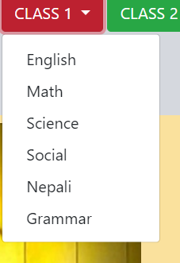

# BTSadmission

1)The files for csv format are in csv for result FILE.

a)csv format for school result.

==>uniquecode,roll,subject,marks,term,class

b)csv format for college result.

==>uniquecode,class,faculty,roll,term,sub,marks

c)csv format for engineering result.

==>uniquecode,sem,faculty,roll,term,sub,marks	

2)RESOURCES while uploading should be spelled the same way as it is in UI of resources.

## Example

